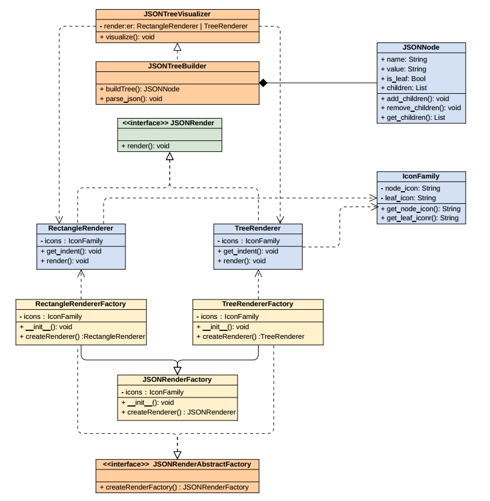

# **Funny JSON Explorer** 

## 作业要求

使用**工厂方法**（Factory）、**抽象工厂**（Abstract Factory）、**建造者**（Builder）模式、**组合模式**实现Funny JSON Explorer，最后提交

1. 设计文档：类图与说明，说明使用的设计模式及作用
2. 运行截图：两种风格，两种图标族，共计4次运行fje的屏幕截图

## 类图

**使用到的设计模式如下：**

- 工厂模式
  - 含义：工厂模式中，父类中提供一个创建对象的方法， 允许子类决定实例化对象的类型。
  - 作用：在本例中，`JSONRendererFactory`，`Treerendererfactory`和`RectangleRendererFacrtory`使用了工厂模式，其中父类`JSONRendererFactory`提供了`createRenderer()`的对象创建方法，但是具体是创建什么对象，由子类决定，其中`Treerendererfactory`返回`TreeRenderer`对象,而`RectangleRendererFacrtory`返回`RectangleRenderer`对象。
- 抽象工厂模式
  - 含义：抽象工厂提供一个创建一系列相关或相互依赖对象的接口，而无需指定它们具体的类。
  - 作用：`JSONRenererAbstractFactory`就是抽象工厂它通过用户传入的参数来决定发挥具体的工厂（这里的工厂就是产品）
- 建造者模式
  - 含义：建造者模式是一种创建型设计模式，它通过将一个复杂对象的构建过程分步骤进行，从而允许按不同的步骤构造出不同的表示。
  - 作用：在本例中，`JSONTreeBuilder`就是建造者模式的体现，他对输入的JSON格式文件进行递归解析，记录每一个结点的深度和孩子结点，方便之后的逐层渲染
- 组合模式
  - 含义：聚合模式将对象组合成树形结构来表现“整体/部分”的层次结构。
  - 作用：本例中，`JSONNode`使用了聚合模式，其提供了`add_children()`, `remove_children()`和`get_children()`等函数，方便我们取管理属性结构的jsontree

其他说明:

- `JSONRender`是抽象产品类，其提供接口，不提供实现，而其子类`TreeRender`和`RectangleRender`实现了接口
- IconFamily是图标族类，其`get_node_icon()`和`get_leaf_icon()`分别返回中间节点和叶子结点的图标
- `JSONTreeVisualizer`通过调用建造者模式建造出来的树和调用renderer实现最终的渲染

## 运行截图

- 树形结构

  - 扑克牌图标族

    

  - 自定义图标族

    

- 长方形结构

  - 扑克牌图标族

    

  - 自定义图标族

    

    
